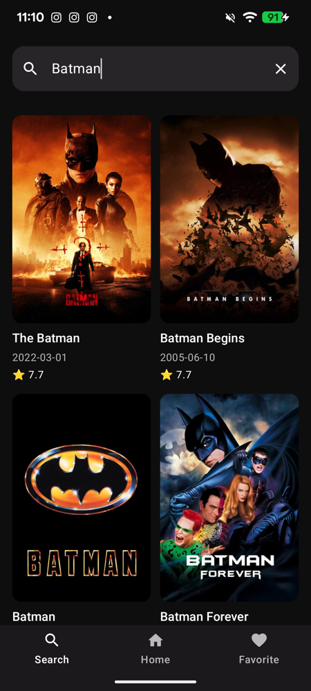
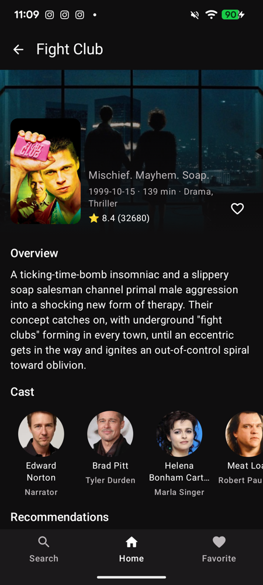
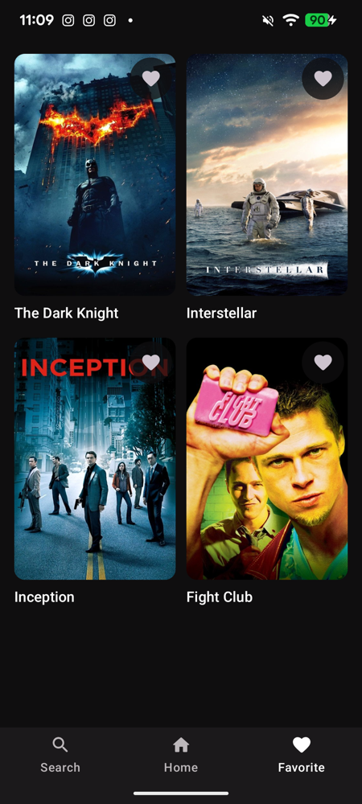
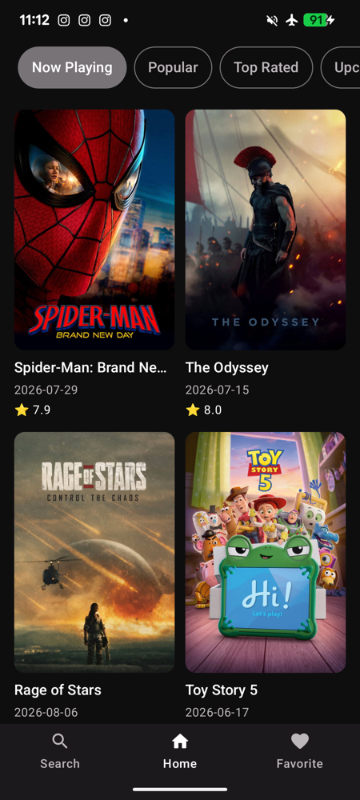
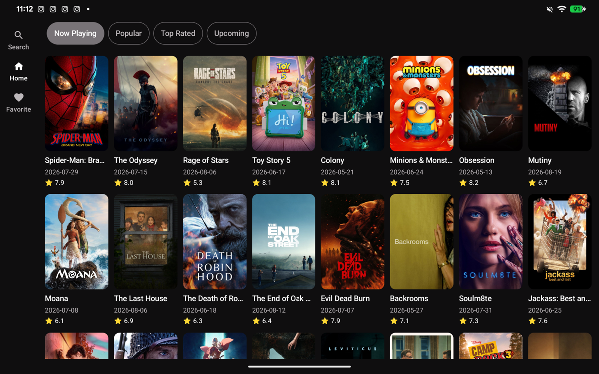

# TMDB


An Android movie browser built on the [TMDB API](https://developer.themoviedb.org/docs) —
browse by category, search as you type, and **keep reading with no network**, on a layout that
adapts from phone to tablet.

| Home | Search | Detail | Favorites |
|---|---|---|---|
|  |  |  |  |

## Offline-first



**Home never reads from the network.** A Paging 3 `RemoteMediator` writes into Room, and the UI
pages out of Room — the network is a background refresh, not the path the screen depends on.

The screenshot on the right is the app in **airplane mode, after a force-stop** — a genuine cold
start with no connection. The grid, posters, dates, and ratings all come back from disk. Nothing
is staged: it is the `prod` flavor against the live API, with the radio off.

A refresh that fails no longer costs you the screen. It surfaces a snackbar and the last-known
list stays where it is, instead of collapsing into an empty state.

<br clear="right" />

## Features

- **Offline-first home** — Room is the single source of truth, refilled in the background by a
  Paging 3 `RemoteMediator`, so the list survives airplane mode and a cold start
- **Browse by category** — popular, now playing, top rated, upcoming
- **Search as you type** — 300 ms debounce, its own paging stream
- **Movie detail** — detail, cast, and recommendations fetched in parallel and combined by one
  use case; the first failure wins
- **Favorites** — persisted in Room, toggled from the detail screen or the favorites tab
- **Adaptive layout** — bottom bar on a phone, navigation rail on a tablet, via Material 3
  `NavigationSuiteScaffold`

  

- **Per-tab back stacks** — each top-level destination keeps its own history
- **Deep links** — `tmdb://home` and `tmdb://movie?id=550`
- **Lottie splash screen**

## Tech stack

- **UI** — Jetpack Compose, Material 3 (adaptive navigation suite)
- **Navigation** — Navigation 3
- **Pagination** — Paging 3 (`PagingSource` for search, `RemoteMediator` for home)
- **Persistence** — Room
- **Dependency injection** — Hilt
- **Networking** — Retrofit, OkHttp, kotlinx.serialization
- **Images** — Coil
- **Animation** — Lottie
- **Async** — Coroutines and Flow

## Architecture

A multi-module Gradle build. Dependencies point one way only, and `:app` is a pure sink —
nothing depends on it.

```
:app                       single Activity, app shell, theme, deep links, E2E tests
 ├─ :feature:<name>:api     the @Serializable NavKey — the route identity, nothing else
 ├─ :feature:<name>:impl    screen, ViewModel, and one entry() extension
 ├─ :core:ui                shared Compose components, UiText, error mapping
 ├─ :core:navigation        NavigationState, per-tab back stacks, Navigator
 ├─ :core:domain            repository interfaces and use cases
 ├─ :core:data              repository impls, RemoteMediator, PagingSource, mappers
 ├─ :core:database          Room database, DAOs, entities
 ├─ :core:network           Retrofit service, DTOs, auth interceptor
 ├─ :core:network-mock      MockTmdbApiService and 25 JSON fixtures
 ├─ :core:common            Result, DataError, dispatcher and time qualifiers
 └─ :core:model             pure-JVM domain model (Movie, MovieCategory, MovieDetail)

:core:testing              unit-test doubles and MainDispatcherRule
:core:data-test            Hilt test runner and the instrumentation network swap
build-logic                convention plugins shared by every module
```

Features are `home`, `search`, `favorite`, and `detail` — each an `api` / `impl` pair.

Each feature splits into an `api` module holding only its `NavKey` and an `impl` module holding
the screen. `impl` exposes one public function — its Navigation 3 entry point — and keeps its
composables `internal`, so there are no cross-feature dependencies. Features reach data through
`:core:domain`, never `:core:data`, so DTOs stay out of the UI layer.

Shared build configuration lives in [`build-logic`](build-logic) as convention plugins.

## Design decisions

**Repository interfaces live in `:core:domain`, not `:core:data`.** A feature module depends on
`:core:domain` alone. It can name a `MovieRepository` without being able to see a DTO, a Room
entity, or Retrofit — the compiler enforces the boundary rather than a code review.

**Home reads from Room, never from the network directly.** `MovieRemoteMediator` fills the
database and Paging reads out of it, so the last-seen list renders offline and a failed refresh
degrades to a snackbar instead of an empty screen.

**Paging is invalidated explicitly, not by waiting on Room.**
[`MovieRepositoryImpl`](core/data/src/main/java/com/yiwenliu/core/data/repository/MovieRepositoryImpl.kt)
wraps the DAO in an `InvalidatingPagingSourceFactory` and invalidates it after the mediator
writes. Relying on Room's own invalidation was a race: switching category could leave the grid
blank because Paging still held a query against the previous category's rows.

**Errors are values, not exceptions.** Data sources return `Result<T, DataError>` through
`safeApiCall` / `safeDatabaseCall`; `:core:ui` maps a `DataError` to a `UiText` at the edge.
Nothing throws across a layer boundary, so a `when` over the error type is exhaustive and the
compiler catches a new error case.

**Mock data is a module, not a build hack.** `:core:network-mock` carries the fake API service
and its JSON. `prodRelease` never lists it as a dependency, so the fixtures are absent from the
release APK by construction — no asset filtering, no ProGuard rule to keep in sync.

**Secrets are validated at build time.** A missing or malformed `BASE_URL` fails the Gradle
build with a message naming the key, instead of producing an installable app that dies on its
first request.

## Setup

Three secrets are required. **The build fails with a message naming the missing key** rather
than producing an app that breaks at runtime. Add them to `local.properties` in the project
root (already git-ignored):

```properties
BASE_URL=https://api.themoviedb.org/3/
IMAGE_URL=https://image.tmdb.org/t/p/
API_TOKEN=<your TMDB v4 read access token>
```

Get `API_TOKEN` from the [TMDB API settings page](https://www.themoviedb.org/settings/api) —
the **API Read Access Token**

Environment variables of the same name also work and are more convenient for CI;
`local.properties` takes precedence, and a key present but empty counts as unset.

Requires JDK 17. `minSdk` is 29, `compileSdk` and `targetSdk` are 36.

## Build variants

| Flavor | Application ID | Data source |
|---|---|---|
| `mock` | `com.yiwenliu.tmdb.mock` | Bundled JSON fixtures in `core/network-mock/src/main/assets/` — no network required |
| `prod` | `com.yiwenliu.tmdb` | The live TMDB API |

The two variants have different application IDs and can be installed side by side. The
build-time secret check applies to both.

```bash
./gradlew :app:installMockDebug
```

## Testing

```bash
./gradlew testMockDebugUnitTest        # unit tests
./gradlew spotlessCheck                # formatting and unused imports
```

Instrumented tests run on a Gradle Managed Device (Pixel 6, API 34) — no emulator to start by
hand:

```bash
./gradlew :app:ciGroupProdDebugAndroidTest
./gradlew :core:database:ciGroupProdDebugAndroidTest
./gradlew :feature:home:impl:ciGroupProdDebugAndroidTest
```

Three layers:

- **Unit tests** are pure JVM — no Robolectric, no Hilt. Data-layer tests are fed by the same
  JSON fixtures the `mock` flavor ships, so the tests and the running app agree on their data.
- **Compose tests** live in each feature module and drive the stateless screen with a fake
  `LazyPagingItems`, so a screen can fail on its own without the rest of the graph.
- **E2E tests** live in `:app` and run on `prodDebug` against the real Hilt graph. The swap
  happens at the *network* layer — the real repository, Room, and Paging code is under test,
  with only the API service faked.

## CI/CD

[`ci.yml`](.github/workflows/ci.yml) runs on every pull request and push to `master`, in three
parallel jobs: Spotless and Android Lint, unit tests with a JaCoCo coverage report, and the
instrumented suite on a managed device. Reports upload as artifacts.

[`cd.yml`](.github/workflows/cd.yml) runs on a `v*` tag. It decodes a keystore from secrets,
assembles a signed, R8-minified `prodRelease`, verifies the signature with `apksigner`, renames
the APK to `tmdb-<version>.apk`, and publishes it to GitHub Releases together with
`mapping.txt`. `versionName` comes from the tag, `versionCode` from the workflow run number.

## Attribution

This product uses the TMDB API but is not endorsed or certified by
[TMDB](https://www.themoviedb.org/).
